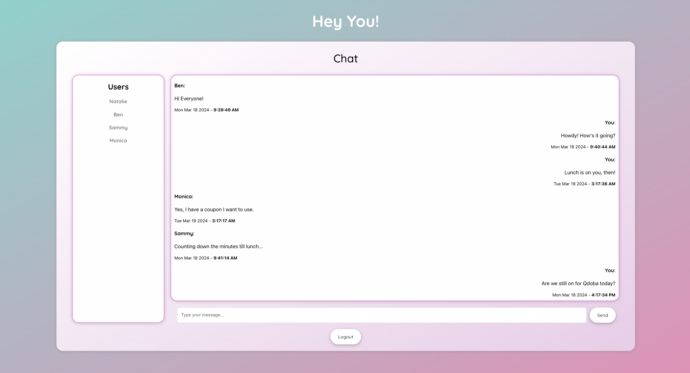
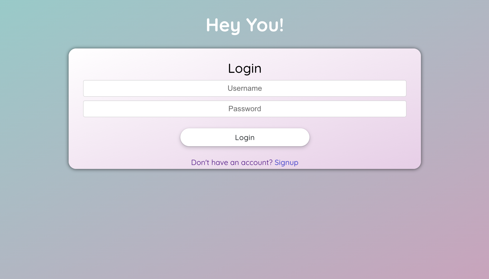
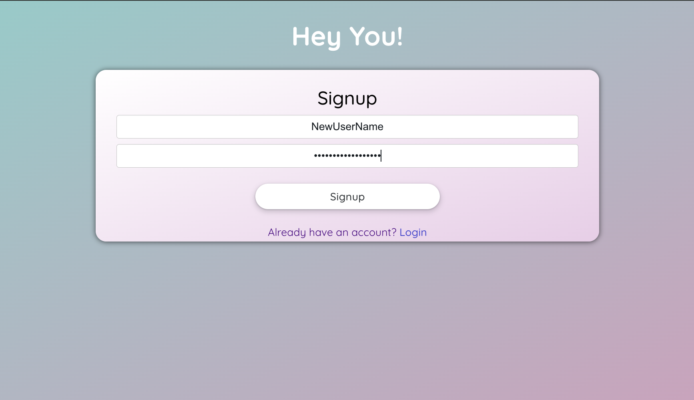

# Hey You! - a place to chat (IN PROGRESS)

Hey You! is a real-time web chat application with a clean and appealing aesthetic. Users an sign up and chat, while knowing they can trust that their login informaiton is protected.

.gif>)

## Features

- WebSocket Communication: Bi-directional communication to enable users to send and receive messages in realtime.
- User authentication using JSON Web Tokens: Users can register, login, and authenticate themselves to access the chat features.
- Secure storage via PostgresSQL: User and message data is securely stored in a PostgreSQL database.
- Lightweight API: The API built with Flask provides efficient communication between the front-end and the database.

#### UPDATE 4/8/24:

Hey You! is functional and the UI/UX is complete. The next step will be to deploy it to AWS EC2 and initialize the postgres DB using AWS RDS.

## Demo

### Chat Page



### Login Page



### Signup Page



## Setup Instructions

### Frontend Setup

1. Clone this repository:

   ```
   git clone https://github.com/natsal33/hey-you-chat-app
   ```

2. Install dependencies:

   ```
   npm install
   ```

3. Start the development server:

   ```
   npm start
   ```

### Backend Setup

1. Navigate to the `./app` directory:

   ```
   cd app
   ```

2. Create a virtual environment:

   ```
   python3 -m venv venv
   ```

3. Activate the virtual environment:

   - On macOS and Linux:

     ```
     source venv/bin/activate
     ```

   - On Windows:

     ```
     venv\Scripts\activate
     ```

4. Set up the PostgreSQL database:

   - Install PostgreSQL if you haven't already: [PostgreSQL Downloads](https://www.postgresql.org/download/)
   - Create a new database and note down the credentials.

5. Configure the Flask application:

   - Run `export FLASK_APP=routes.py"

6. Run the Flask application:

   ```
   flask run
   ```

## Tech Stack

- Frontend:

  - React
  - JavaScript
  - HTML/CSS

- Backend:

  - WebSockets
  - Flask (Python)

- Database:
  - PostgreSQL

## License

This project is licensed under the MIT License. See the [LICENSE](LICENSE) file for details.

## Contact

If you have any questions or suggestions, feel free to contact me at natmsal33@gmail.com. I'd love to hear from you!
